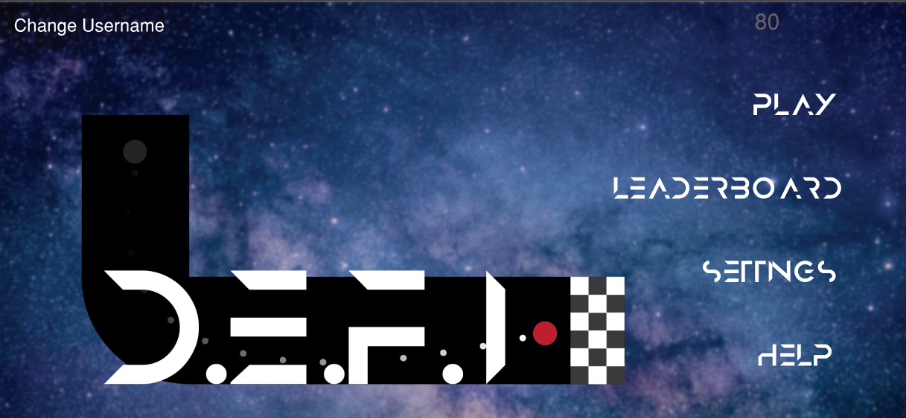
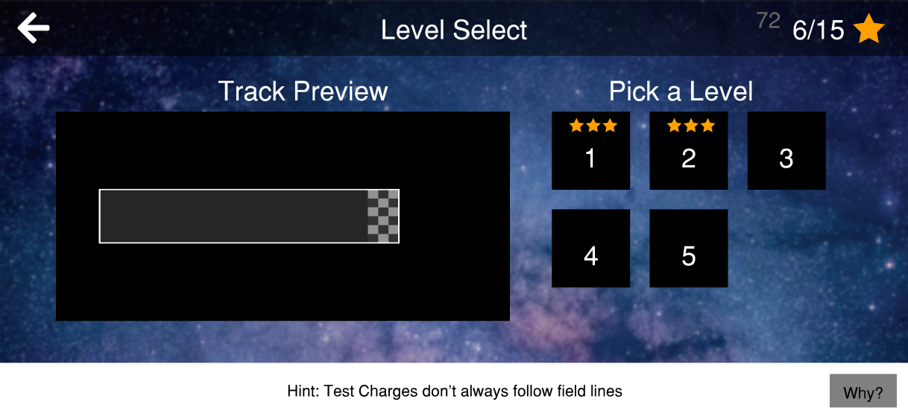
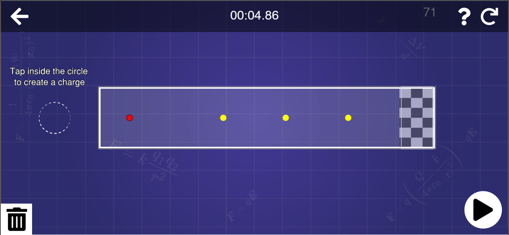

<!--
*** Thanks for checking out the Best-README-Template. If you have a suggestion
*** that would make this better, please fork the repo and create a pull request
*** or simply open an issue with the tag "enhancement".
*** Thanks again! Now go create something AMAZING! :D
-->


<!-- PROJECT SHIELDS -->
<!--
*** I'm using markdown "reference style" links for readability.
*** Reference links are enclosed in brackets [ ] instead of parentheses ( ).
*** See the bottom of this document for the declaration of the reference variables
*** for contributors-url, forks-url, etc. This is an optional, concise syntax you may use.
*** https://www.markdownguide.org/basic-syntax/#reference-style-links
-->
<!-- [![Contributors][contributors-shield]][contributors-url]
[![Forks][forks-shield]][forks-url]
[![Stargazers][stars-shield]][stars-url]
[![Issues][issues-shield]][issues-url]
[![MIT License][license-shield]][license-url]
[![LinkedIn][linkedin-shield]][linkedin-url] -->


<!-- PROJECT LOGO -->
<br />
<p align="center">
  <a href="https://github.com/othneildrew/Best-README-Template">
    
  </a>

  <h3 align="center">DEFI Game</h3>

  <p align="center">
    Documentation on how the game works and how you can add to it.
    <br />
    <a href="https://efieldsim.ithaca.edu/site/game.html"><strong>Play Game »</strong></a>
    <br />
    <br />

  </p>
</p>


<!-- TABLE OF CONTENTS -->
<details open="open">
  <summary>Table of Contents</summary>
  <ol>
    <li>
      <a href="#about-the-project">About The Project</a>
      <ul>
        <li><a href="#Languages-and-Libraries">Languages and Libraries</a></li>
        <li><a href="#Learning-Objectives">Learning Objectives</a></li>
      </ul>
    </li>
    <li>
        <a href="#Design">Design</a>
        <ul>
            <li><a href="#Mayer's-Principles-of-Multimedia-Learning">Mayers Principles of Multimedia Learning</a></li>
            <li><a href="#Inspiration">Inspiration</a></li>
        </ul>
    </li>
    <li>
        <a href="#Code">Code</a>
        <ul>
            <li><a href="#p5.js-Basics">p5.js Basics</a></li>
            <li><a href="#Screens">Screens</a></li>
            <li><a href="#Collision-Detection">Collision Detection</a></li>
            <li><a href="#Screens">Screens</a></li>
        </ul>
    </li>
    <li>
        <a href="#Physics">Physics</a>
        <ul>
            <li><a href="#Test-Charge-Movement">Test Charge Movement</a></li>
            <li><a href="#Field-Lines">Field Lines</a></li>
        </ul>
    </li>
    <li><a href="#contributing">Contributing</a></li>
    <li><a href="#contact">Contact</a></li>
    <li><a href="#acknowledgements">Acknowledgements</a></li>
  </ol>
</details>


<!-- ABOUT THE PROJECT -->
## About The Project

[![Product Name Screen Shot][product-screenshot]](https://efieldsim.ithaca.edu/site/game.html)

Because electric fields cannot be touched or seen, simulations are often utilized to build students' understanding of them by providing them with a visual of electric fields and the motion of test charges through them. The objective of the simulation is to improve students’ qualitative understanding of how electric fields are impacted by a configuration of charges by creating a dynamic representation of the electric field lines, field vectors, equipotential lines and the voltage created by the charges on screen. After creating a charge configuration, the simulation visualizes the motion of test charges through the electric field. 

The core physics principles of the simulation have also been used as the foundation of the mechanics of an educational game. Our aim in the gamification of the simulation is to improve motivation and engagement in the material. Both the simulation and game were built in JavaScript so they will run on most browsers on a computer or mobile device. 


### Learning Objectives
Students will be able to:
* Predict the general shape and direction of electric field lines for a system of charges
* Relate the shape of equipotential lines to the shape of electric field lines
* Compare the curve of the electric field lines to the trajectory of a test charge


### Languages and Libraries

The entire game runs inside a canvas tag in a webpage, so it is accessible from both mobile phones and computers. HTML and CSS are used to set up the page then p5.js creates the canvas with the game loop and everything else. Everything else is done in Javascript. 
* [Javascript](https://www.w3schools.com/js/default.asp)
* [p5.js](https://p5js.org/)
* [HTML](https://www.w3schools.com/html/default.asp)
* [CSS](https://www.w3schools.com/css/default.asp)


## Design

The game is primarily designed to target the learning goals listed above. Intuition and multimedia learning resources were used when making the smaller decisions in the game. 

### Game Play

The gameplay is broken down into a few distinct parts.

While in "Build" mode:
* You add neutral charges to the screen by touching anywhere on the screen 
* You can then use the slider that appears on the bottom of the screen to adjust the magnitude and sign of the charge that you just created. 
* As you add, remove or adjust the magnitude of test charges, you will see a live representation of how the electric field changes as well as a small hint as to what the trajectory of the test charge will look like. 
* When you are satisfied with the electric field that you have created, you can press the “Play” button to see the full trajectory of the test charge in your electric field. 

While in "Play" mode:
* you cannot edit any charge's location or magniude but not the test charge will move in accordace to the electric field. 
* When the test charge touches any of the stars, they are collected and will improve your score
* If the test charge hits the edge of the track, it stops moving and you need to click the "Build" button to edit your charge configuration to change the resulting electric field.


### Mayer's Principles of Multimedia Learning

* Manage the extraneous load by limiting the cognitive effort on material or details that don’t support the learning outcomes while still making the game engaging

* Manage the intrinsic load (the cognitive effort required to represent the material in working memory) by focusing narrowly on the essential material and eschewing everything that could distract learners

* Manage the germane load (the effort required of learners to actually understand the material) to keep players motivated. We tried to optimize the germane load by scaffolding learning and pacing material appropriately.

More info on Mayer's Principles of Multimedia Learning [here](https://ctl.wiley.com/principles-of-multimedia-learning/).

### Inspiration

Games used as inspiration for this


## Code

Object-oriented programming is used throughout the game. The Screen, Button, Popup, FieldLine, Image, Screen, Star, TestCharge and Track classes can be found in own their self-titled files. Functions that primarily only use that one class can also be found in that classes self-titled file. 

The p5.js library is inside the file titled p5.min.js. It should not be tampered with. The library creates the game loop and has useful Vector math functions.

There is a file called variables.js that has all global variables in it. They can technically be declared anywhere but this is a little more organized. 

JavaScript has inbuild functions that can be done to arrays that are used throughout this game. Learn more about them here: [https://www.w3schools.com/jsref/jsref_obj_array.asp](https://www.w3schools.com/jsref/jsref_obj_array.asp)


### p5.js Basics

When the page is first loaded, the p5.js library will look for the preload(), setup() and draw functions. They are run in that order. 

The preload() function is used to handle asynchronous loading of external files in a blocking way. If a preload function is defined, setup() will wait until any load calls within have finished. This is where all of the images and fonts are moved to the user's RAM for later usage. 

The setup() function is called once when the program starts. It's used to create the canvas tag which is not included in the HTML file wih the rest of the HTML tags. There can only be one setup() function for each program and it shouldn't be called again after its initial execution.

Called directly after setup(), the draw() function continuously executes the lines of code contained inside its block until the program is stopped. The number of times draw() executes in each second may be controlled with the frameRate() function.

All of these functions can be found in the game.js file. 

### Screens
The game works around different "screens" that are all created when the game first launches but only one screen is visible and can be interacted with at any given time.

These are examples of screens:





In the first screen, there are 4 buttons that navigate to different screens and one image on the track and game title. The second screen has the title "Level Select", some navigation buttons and an image. The third screen has a stopwatch as its title and buttons to interact with the game.


The createScreens() function in the screens.js file creates each screen and gives it its unique properties. These include the name of the screen, the textboxes and the buttons that are used in said screen. All screens are stored in an array called screens. 

The draw() function displays whichever screen the user is on every frame. While that screen is being displayed, all the buttons, textboxes and images that are associated with the screen are also shown. 


This is how a screen is created:
   ```sh
   new Screen({
            name: "",       // Will not be seen by tthe user. Only used for navigaiton - STRING
            title: "",      // This will be displayed on the screen - STRING
            titlePosition: createVector(0, 0),      // x-y vector position of title
            titleFontSize: 24,          // title font size - INT
            visibility: "",             // visibiliy of screen. Only visible when user is on the screen - STRING
            backgroundColor: "",        //  Background color - STRING 
            buttons: [],                // Create button objects for every button that will appear - ARRAY of objects
            textBoxes: [],              // create textbox objects fot every textbox that will appear - ARRAY of objects
            })
   ```


### Buttons
Each Screen has its own buttons. Buttons will visually showup on the screen and will do whatever funtion is assigned to them when they are clicked. They know they are clicked because of collision detection based on the buttons shape and size. 

The clicked() function inside the Button class in the button.js file tells the game what to do when the button is clicked. For now, there is a giant if statement that checks which button was clicked and runs he functions needed.

This is how a button is created:
   ```sh
   new Button({
       x: 662,              // x position - INT
       y: 75,               // y position - INT
       width: 100,          // width - INT
       height: 40,          // height - INT
       title: "" ,          // text shown on button - STRING
       onClick: "",         // function ran when button is clicked - STRING
       shape: "",           // shape used for collision detection - STRING
       bgColor: "",         // background color - STRING
       fontColor: "",       // font color - STRING
       fontSize: 24,        // font size - INT
       font: spaceFont      // font of text displayed - Font decared in preload()
       })
   ```

### Pop Ups
Each Screen has its own buttons. Buttons will visually showup on the screen and will do whatever funtion is assigned to them when they are clicked. They know they are clicked because of collision detection based on the buttons shape and size. 

The clicked() function inside the Button class in the button.js file tells the game what to do when the button is clicked. For now, there is a giant if statement that checks which button was clicked and runs he functions needed.

This is how a button is created:
   ```sh
   new Popup({
      name: "Help", // this is the name of the popup that will be used when making it visible - String
      size: createVector(700,300),  this is the size of the popup. A full screen popup will have a width of 812 and height of 375 - Vector
      numberOfSlides: 4, // this controls the next buttons. When the current slide number is equal to the total slides, the right button dissapears and when the current slide number is equal to 0, the left button disappears - INT
      textBoxes: [
          new TextBox({x: (812 * 0), y: 80, class: textClass.popUpTitle, text: "Goal"}), 
          new TextBox({x: 150 + (812 * 0), y: 130, class: textClass.popUpBody, text: "Get the test charge to the finish line by building an electric field.\n\nDo not hit the walls of the track.\n\nCollect as many stars as possible \n\nFinish the level as fast as possible"}), 

          new TextBox({x: (812 * 1), y: 80, class: textClass.popUpTitle, text: "Two Modes"}), 
          new TextBox({x: 150 + (812 * 1), y: 130, class: textClass.popUpBody, text: " There are two game modes.\n\nIn the “Build” mode you can build an electric field\n\nIn the “Play” mode, your electric field pushes the test charge through."}), 

          new TextBox({x: (812 * 2), y: 80, class: textClass.popUpTitle, text: "Creating an Electric Field"}), 
          new TextBox({x: 150 + (812 * 2), y: 130, class: textClass.popUpBody, text: "While in the “Build” mode, click anywhere on the screen to place a charge there.\n\nUse the slider to change the slider’s magnitude and sign.\n\nYou can drag charges around.\n\nDrag charges to the bottom right to delete them."}), 

          new TextBox({x: (812 * 3), y: 80, class: textClass.popUpTitle, text: "Electric Fields"}), 
          new TextBox({x: 150 + (812 * 3), y: 130, class: textClass.popUpBody, text: "Electric fields will only exert a force on test charge in “Play” mode.\n\nAll test charges are positive so they will be pushed away from positive charges and pulled towards negative charges. "}), 

          // this is where all the Textbox objects that will appear in the slide go. The x position of these will change when a user moves to a new slide.
      ],
      images: [
          new MyImage({image: popUpImage.gameMode, x: 450, y: 150, size: createVector(220, (220 * (384/600)))}),
          new MyImage({image: popUpImage.track, x: 1260, y: 150, size: createVector(230, (230 * (309/600)))}),
          new MyImage({image: popUpImage.slider, x: 2100, y: 130, size: createVector(160, (160 * (600/537)))}),
          new MyImage({image: popUpImage.eField, x: 2900, y: 130, size: createVector(200, (200 * (537/600)))}),

          // this is where all the MyImage objects that will appear in the slide go. The x position of these will change when a user moves to a new slide.
      ],
      buttons: [
          new Button({x: 730, y: 60 , width: 20, height: 20, title: "x" , onClick: function(){ closePopup()      }, shape: "Rect", bgColor: "black", fontColor: "white", fontSize: 14}), 
          new Button({x: 80 , y: 190, width: 20, height: 20, title: "<" , onClick: function(){ movePopup("left") }, shape: "Rect", bgColor: "black", fontColor: "white", fontSize: 14}), 
          new Button({x: 710, y: 190, width: 20, height: 20, title: ">" , onClick: function(){ movePopup("right")}, shape: "Rect", bgColor: "black", fontColor: "white", fontSize: 14}), 

          // this is where all the Button objects that will appear in the slide go. The x position of these will change when a user moves to a new slide.
      ],
      // functions: { // this function runs every frame when the popup is visible. Comment it out if you dont want anything to run},
  }),
   ```


### Charges


This is how a charge is created. 
   ```sh
class Charge
    {
    constructor(x, y, charge)
    {
        this.x = x;
        this.y = y;
        this.position = createVector(x,y);
        this.charge = charge || 0;
        this.selected = true;
        this.dragging = false;
    }

    display()
    {
        let charge = this;
        
    
        push();
        strokeWeight(2);
        if (charge.selected)
        {
            stroke(255);
            charge.charge = slider.value();
        }
        else
        {
            noStroke();
        }

        if (charge.charge > 0){ fill(chargeColor.positive); }
        else if (charge.charge == 0){ fill(chargeColor.neutral); }
        else { fill(chargeColor.negative); }
        ellipse(charge.x, charge.y, chargeDiameter, chargeDiameter);

        textSize(16);
        if (charge.charge > 0){ fill(textColor.positive); }
        else if (charge.charge == 0){ fill(textColor.neutral); }
        else { fill(textColor.negative); }
        noStroke();
        if (charge.charge > 0)
        {
            text(`+${charge.charge}`, charge.x, charge.y + 7);
        }
        else
        {
            text(charge.charge, charge.x, charge.y + 7);
        }
        pop();
    }
    
    }
   ```

### Collision Detection

There are a few different methods of collision deection throuout the game. The first kind works only with circles and squares and the second type works with all shapes. The key difference between the two types of collisions is that the first kind will return true whenever a point is inside another shape and the second type of collision will only return true when a point collides with the edge of a shape. 

This is how the first kind of collision detection is used for something like button collisions. This can be seen in the mouseEvents.js file inside the mouseClicked() function.
```sh
if (button.shape == "Circle") 
{
    let distance = mousePosition.dist(button.position);     // vector.dist(vector) gets the distance between two vectors 
    if (distance < button.width / 2)                        // if that distance is less than the radius of the circle
    {                                                       // the user clicked inside the circle
        button.clicked();
        buttonClicked = true;
    }
}
else
{
    if (mousePosition.x > button.x &&                       // if the button is a rectangle, the mouse position is 
        mousePosition.y > button.y &&                       // compared to the edges of the rectangle to see if it lies
        mousePosition.x < button.x + button.width &&        // bewtween the shapes bounds
        mousePosition.y < button.y + button.height)
    {
        button.clicked();
        buttonClicked = true;
    }
}
```

The second type of collision detection is used to see if a test charge has collided with the walls of a track or not. The tracks collision bot is made up of points around the perimiter of the track. The points are listed in a connect-the-dots style order. The points are then connected and turned into "sides" of a shape. All of the sides are straight lines. The testcharge is treated as a decagon eventhough it appears as a circle on the screen. This is to check the collisions between the straight lines that make up the decagon and the straight lines that make up the perimiter of a shape. 

The code below will check if two straight lines intersect at any point. 
```sh
function collide(p1, p2)        // p1 and p2 are two different shapes
{
  for(let i in p1.n)            // p1.n and p2.n are the lines that make up the edges of each shape
  {
        for(let j in p2.n)          // they are in a nested loop to check each lines disance from all the other lines
        {
            let t = intersect(p1.n[i],p2.n[j]);         // this function can be seen below and will check if the two lines
            if(t === 'collinear') {continue;}           // intersect or not
            if(t[0] <= 1 && t[0] >= 0 && t[1] <= 1 && t[1] >= 0) 
            {
                return true;        // this happens if they are not colinear
            }
        }
  }
  return false;                 // this happens if they are colinear
}

function intersect(s1,s2)       // s1 and s2 are two different lines. They are each made up of two sets of points 
{                               // to mark the begining and end of each line. 
    if(((s2[1].x - s2[0].x)*(s1[0].y - s1[1].y) - (s1[0].x - s1[1].x)*(s2[1].y - s2[0].y)) === 0) 
    {
        return 'collinear';         // if they are collinear, they are intersecting. 
    }
    let tA =  ((s2[0].y - s2[1].y) * (s1[0].x - s2[0].x) + (s2[1].x - s2[0].x) * (s1[0].y - s2[0].y))/
              ((s2[1].x - s2[0].x) * (s1[0].y - s1[1].y) - (s1[0].x - s1[1].x) * (s2[1].y - s2[0].y)),
        tB =  ((s1[0].y - s1[1].y) * (s1[0].x - s2[0].x) + (s1[1].x - s1[0].x) * (s1[0].y - s2[0].y))/
              ((s2[1].x - s2[0].x) * (s1[0].y - s1[1].y) - (s1[0].x - s1[1].x) * (s2[1].y - s2[0].y));
    return [tA, tB];
}
```


## Physics

Physics concepts related to 

 
 and superimposed electric fields given by 
 are used to run the game. 


### Test Charge Movement
There is a netForceAtPoint() function in game.js that is given an x-y position vector as an input and outputs a vector with x and y components. It does this using Coulomb's Law and trig. 

   ```sh
   function netForceAtPoint(position) // the position comes in in a createVector(x,y) format
{
    let finalVector = createVector(0,0);        // starts with a 0 vector
    
    charges.forEach(charge =>       // calculates force from each charge and adds them to the finalVector variable
    {
        let chargePosition = createVector(charge.x, charge.y);      //position of charge object

        //F = KQ / (r^2)                                    // k is a constant that is used to fine tune the size of the force vector
        let kq = charge.charge * k;                         // q is the magnitude and sign of the charges charge
        let r = p5.Vector.dist(position, chargePosition);   // gets the distance from the charge to the point in pixels
        if (r < 10)
        {                                                   // this prevents the radius from being too small
            r = 10;                                         // and keeps the net force capped at a resonable size. 
        }                                                   // also prevents dividing by zero    
        let rSquared = Math.pow(r,2);

        //F = KQ / (r^2)                                    // coulombs law
        let force = kq / rSquared;                          // magnitude of force

        let theta = chargePosition.sub(position).heading();     // angle from point to charge
        let forceX = force * cos(theta);
        let forceY = force * sin(theta);

        let forceVector = createVector(forceX, forceY).mult(-1);    // force from the one charge
        
        finalVector.add(forceVector);                               // adds the one force to the net force
    });

    return finalVector;         // returns net force in a vector format
}
   ```

This function is used to move test charges by calculating the net force on the charge every frame and using euler's method to translate the net force to an acceleration to a velocity to an x-y position on the screen. This is how Euler's method is implimented with code

```sh
let force = netForceAtPoint(testCharge.position);

if (force.mag() != Infinity && testCharge.moving)       // if the distance between two points is zero, the magnitude of the 
{                                                       // force would be infinity. testCharge.moving is true when the gamemode
    // F  = qE                                          // is "Play"
    // ma = qE
    // a  = (qE)/m
    // m = 1
    // a = qE
    testCharge.acceleration = force.mult(testCharge.charge);    // E = force and q = testCharge.charge
    testCharge.velocity.add(testCharge.acceleration);           // the next two lines are eulers method
    testCharge.position.add(testCharge.velocity);
}
```

### Field Lines
The netForceAtPoint() function seen above is also used to draw field lines by creating a starting point inside a charge and converting the net force at that point into a unit vector of length 5 pixels. Recursion is then used to keep adding a new force unit vector to the tip of the previous one until one end of the vector has collided with a charge. Each starting point begins at a new position around the charge. 

The getFieldLinePoints() function in fieldLines.js has 3 inputs. The first input is an x position and the second input is a y position. The third input is the position of the charge in the charges array that the field line will come out of. When the field line either hits a charge with a different index in the charges array or is very far from it's original starting point, then field line is finished. The function will return an array of points that can be connected together in order to make a field line. 

The createFieldLines() funcion will create all of the field lines necessary for the configuration of charges on screen. 


```sh
charges.forEach((charge, i) =>      // loops through each charge in the charges array and gives it an index i
{
fieldLines[i] = [];


let radius = chargeRadius + 1;      // the starting point for field lines is one pixel outside the circle that makes up a charge
                                    // this is so the field line is not colliding with itself and stopping the recursion
let times = Math.abs(charge.charge) * fieldLinesPerCoulomb;     // the number of field lines coming out of a charge grows with the charges magnitude
let origin = charge.position;       //the place the field lines originae from


let point = createVector(0, radius);
for (let a = 0; a < times; a++)
{
    getFieldLinePoints(point.x + origin.x, point.y + origin.y, i);      // this function gets an array of points that make up the field like starting at the field lines origin
    point.rotate(360/times);        // this rotates the starting point of the field line around the charge in accordance to the charges magnitude
}
});
```


```sh
function getFieldLinePoints(x, y, baseCharge)
{
  let position = createVector(x,y);
  let forceVector = netForceAtPoint(position);
  forceVector.setMag(chargeRadius);

  let forceVectorFinalPosition = p5.Vector.add(forceVector, position);
  let vectorToChargeDistance = p5.Vector.dist(forceVectorFinalPosition, charges[0].position);

  let startingPointIsInsideCharge = false;
  let i = 0;
  let chargesLength = charges.length;
  for (i; i < chargesLength; i++)
  {
    let distanceFromEndOfVectorToCharge = p5.Vector.dist(position, charges[i].position);
    if (distanceFromEndOfVectorToCharge < (chargeRadius) && charges[i].charge != 0)
    {
      startingPointIsInsideCharge = true;
    }
  }

  if (!startingPointIsInsideCharge && vectorToChargeDistance < windowSize)
  {
    try
    {
      points.push(position);
      getFieldLinePoints(forceVectorFinalPosition.x, forceVectorFinalPosition.y, baseCharge);
    }
    catch (e)
    {
      //console.log(e);
    }
  }
  else
  {
    points.unshift(charges[baseCharge].position);

    let chargeDistances = [];
    for (let i = 0; i < charges.length; i++)
    {
      chargeDistances.push(charges[i].position.dist(points[points.length - 1]));
    }
    let closestChargeDistance = Math.min(...chargeDistances);

    for (let i = 0; i < chargeDistances.length; i++)
    {
      if (chargeDistances[i] == closestChargeDistance && closestChargeDistance < 100)
      {
        let halfWayPoint = points[points.length - 1].add(charges[i].position).div(2);
        points.push(halfWayPoint);

        halfWayPoint = points[points.length - 1].add(charges[i].position).div(2);
        points.push(halfWayPoint);

        points.push(p5.Vector.add(charges[i].position, createVector(1, 0)));
      }
    }

    fieldLines.push(new FieldLine(points));
    points = [];
  }
}
```


<!-- CONTRIBUTING -->
## Contributing

1. Fork the Project
2. Create your Feature Branch 
3. Commit your Changes
4. Push to the Branch 
5. Open a Pull Request


<!-- CONTACT -->
## Contact

Dr. Colleen Countryman - [Assistant Professor](https://www.ithaca.edu/academics/school-humanities-and-sciences/physics-and-astronomy/faculty-staff/colleen-countryman) - ccountryman@ithaca.edu


Project Link: [https://github.com/tedkmburu/DEFI-Game](https://github.com/tedkmburu/DEFI-Game)


<!-- ACKNOWLEDGEMENTS -->
## Acknowledgements

* Dr. Colleen Countryman
* Dr. John Barr

* Sean Blackford
* Amber Elliott
* Ted Mburu
* Eli Robinson
* Mark Volkov
* Yemi Afobali
* Liana Rodelli

* Ithaca College Physics & Astronomy Department
* Ithaca College IT
* P5.js (p5js.org)
* Daniel Shiffman (The Coding Train)


<!-- MARKDOWN LINKS & IMAGES -->
<!-- https://www.markdownguide.org/basic-syntax/#reference-style-links -->
[contributors-shield]: https://img.shields.io/github/contributors/othneildrew/Best-README-Template.svg?style=for-the-badge
[contributors-url]: https://github.com/othneildrew/Best-README-Template/graphs/contributors
[forks-shield]: https://img.shields.io/github/forks/othneildrew/Best-README-Template.svg?style=for-the-badge
[forks-url]: https://github.com/othneildrew/Best-README-Template/network/members
[stars-shield]: https://img.shields.io/github/stars/othneildrew/Best-README-Template.svg?style=for-the-badge
[stars-url]: https://github.com/othneildrew/Best-README-Template/stargazers
[issues-shield]: https://img.shields.io/github/issues/othneildrew/Best-README-Template.svg?style=for-the-badge
[issues-url]: https://github.com/othneildrew/Best-README-Template/issues
[license-shield]: https://img.shields.io/github/license/othneildrew/Best-README-Template.svg?style=for-the-badge
[license-url]: https://github.com/othneildrew/Best-README-Template/blob/master/LICENSE.txt
[linkedin-shield]: https://img.shields.io/badge/-LinkedIn-black.svg?style=for-the-badge&logo=linkedin&colorB=555
[linkedin-url]: https://linkedin.com/in/othneildrew
[product-screenshot]: images/screenshot.png